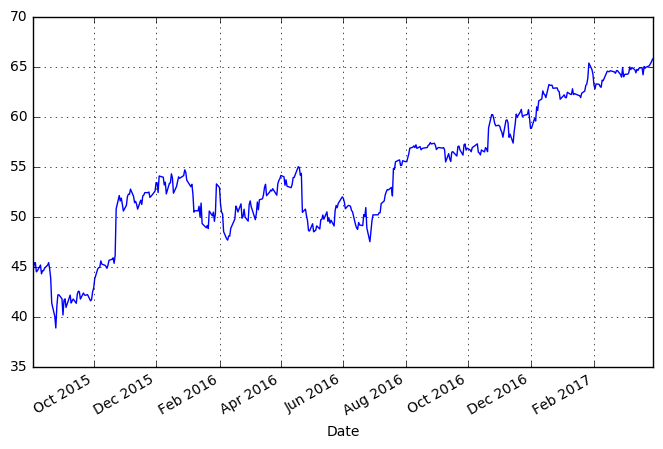

```python
import pandas as pd
import numpy as np
import datetime
import matplotlib
# matplotlib.use('Agg') # Must be before importing matplotlib.pyplot or pylab!
import matplotlib.pyplot as plt
from datetime import date
import pandas_datareader.data as web
```


```python
start = date(2015, 8, 1)
end = date.today()
```


```python
stock = web.DataReader("MSFT", 'yahoo', start, end)
stock.info()
# stock.tail()
```

    <class 'pandas.core.frame.DataFrame'>
    DatetimeIndex: 420 entries, 2015-08-03 to 2017-03-31
    Data columns (total 6 columns):
    Open         420 non-null float64
    High         420 non-null float64
    Low          420 non-null float64
    Close        420 non-null float64
    Volume       420 non-null int64
    Adj Close    420 non-null float64
    dtypes: float64(5), int64(1)
    memory usage: 23.0 KB


```python
max = stock["High"].max()
min = stock["Low"].min()
max
# min
```


    66.190002000000007


```python
stock["Adj Close"].plot(grid=True, figsize=(8,5))
plt.show()
```





```python
stock["Return"] = 0.0
stock['Return'] = np.log(stock['Adj Close']/stock['Adj Close'].shift(1))
stock[["Adj Close", "Return"]].tail()
```


<div>
<table border="1" class="dataframe">
  <thead>
    <tr style="text-align: right;">
      <th></th>
      <th>Adj Close</th>
      <th>Return</th>
    </tr>
    <tr>
      <th>Date</th>
      <th></th>
      <th></th>
    </tr>
  </thead>
  <tbody>
    <tr>
      <th>2017-03-27</th>
      <td>65.099998</td>
      <td>0.001845</td>
    </tr>
    <tr>
      <th>2017-03-28</th>
      <td>65.290001</td>
      <td>0.002914</td>
    </tr>
    <tr>
      <th>2017-03-29</th>
      <td>65.470001</td>
      <td>0.002753</td>
    </tr>
    <tr>
      <th>2017-03-30</th>
      <td>65.709999</td>
      <td>0.003659</td>
    </tr>
    <tr>
      <th>2017-03-31</th>
      <td>65.860001</td>
      <td>0.002280</td>
    </tr>
  </tbody>
</table>
</div>


```python

```
