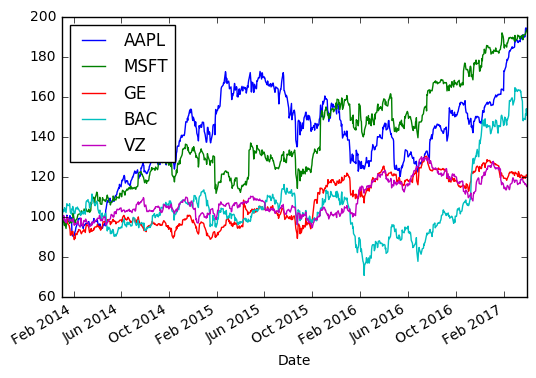
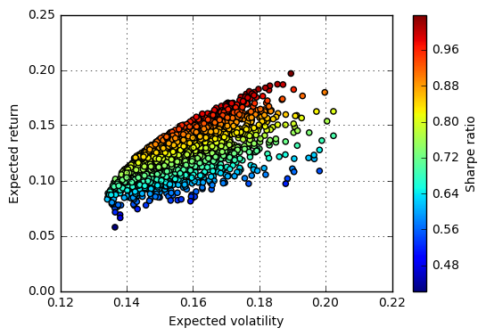

```python
import pandas as pd
import numpy as np
import datetime
from datetime import date
import matplotlib.pyplot as plt
import pandas_datareader.data as web
```


```python
start = date(2014, 1, 1)
end = date.today()
```


```python
portfolio = ["AAPL","MSFT","GE","BAC", "VZ"]
data = pd.DataFrame()
for co in portfolio:
    data[co] = web.DataReader(co, 'yahoo', start, end)["Adj Close"]
```


```python
(data/data.ix[0] * 100).plot()
plt.show()
```





```python
#Calculating returns
returns = np.log(data/data.shift(1))
returns.tail()
```


<div>
<table border="1" class="dataframe">
  <thead>
    <tr style="text-align: right;">
      <th></th>
      <th>AAPL</th>
      <th>MSFT</th>
      <th>GE</th>
      <th>BAC</th>
      <th>VZ</th>
    </tr>
    <tr>
      <th>Date</th>
      <th></th>
      <th></th>
      <th></th>
      <th></th>
      <th></th>
    </tr>
  </thead>
  <tbody>
    <tr>
      <th>2017-03-27</th>
      <td>0.001705</td>
      <td>0.001845</td>
      <td>-0.009466</td>
      <td>-0.003900</td>
      <td>-0.010929</td>
    </tr>
    <tr>
      <th>2017-03-28</th>
      <td>0.020515</td>
      <td>0.002914</td>
      <td>0.006096</td>
      <td>0.019351</td>
      <td>0.003251</td>
    </tr>
    <tr>
      <th>2017-03-29</th>
      <td>0.002223</td>
      <td>0.002753</td>
      <td>0.002024</td>
      <td>-0.005552</td>
      <td>-0.003454</td>
    </tr>
    <tr>
      <th>2017-03-30</th>
      <td>-0.001319</td>
      <td>0.003659</td>
      <td>0.006381</td>
      <td>0.022025</td>
      <td>-0.001426</td>
    </tr>
    <tr>
      <th>2017-03-31</th>
      <td>-0.001878</td>
      <td>0.002280</td>
      <td>-0.002346</td>
      <td>-0.011800</td>
      <td>-0.006339</td>
    </tr>
  </tbody>
</table>
</div>


```python
#Mean-variance of returns
#Since we have significant differences in performance, 
#we have to use 252 trading days to annualize the daily returns 
returns.mean() * 252
```


    AAPL    0.204135
    MSFT    0.203354
    GE      0.057906
    BAC     0.129535
    VZ      0.043478
    dtype: float64


```python
#Building covariance matrix
returns.cov() * 252
```


<div>
<table border="1" class="dataframe">
  <thead>
    <tr style="text-align: right;">
      <th></th>
      <th>AAPL</th>
      <th>MSFT</th>
      <th>GE</th>
      <th>BAC</th>
      <th>VZ</th>
    </tr>
  </thead>
  <tbody>
    <tr>
      <th>AAPL</th>
      <td>0.055111</td>
      <td>0.023192</td>
      <td>0.015336</td>
      <td>0.020350</td>
      <td>0.009796</td>
    </tr>
    <tr>
      <th>MSFT</th>
      <td>0.023192</td>
      <td>0.052022</td>
      <td>0.018468</td>
      <td>0.024264</td>
      <td>0.014079</td>
    </tr>
    <tr>
      <th>GE</th>
      <td>0.015336</td>
      <td>0.018468</td>
      <td>0.031990</td>
      <td>0.023962</td>
      <td>0.010983</td>
    </tr>
    <tr>
      <th>BAC</th>
      <td>0.020350</td>
      <td>0.024264</td>
      <td>0.023962</td>
      <td>0.071086</td>
      <td>0.009599</td>
    </tr>
    <tr>
      <th>VZ</th>
      <td>0.009796</td>
      <td>0.014079</td>
      <td>0.010983</td>
      <td>0.009599</td>
      <td>0.023973</td>
    </tr>
  </tbody>
</table>
</div>


```python
#We assume that we do not open short position and we divide our money equally divided among 5 stocks
#So we generate 5 random numbers and then normalize them so that values would sum up 100% net oper assets
noa = len(portfolio)
weights = np.random.random(noa)
weights /= np.sum(weights)
weights
```


    array([ 0.34867307,  0.06862492,  0.37434609,  0.13682898,  0.07152693])


```python
#Calculating Expected portfolio return based on the weights
expected_return = np.sum(returns.mean() * weights) * 252
expected_return
```


    0.1276425936209541


```python
#Now lets calculate Expected portfolio variance using our covariance matrix
#we use np.dot -  gets us a product of two matrices
expected_variance = np.dot(weights.T, np.dot(returns.cov() * 252, weights))
expected_variance
```


    0.025198873819142972


```python
#Now we calculate expected standard deviation or volatility 
volatility = np.sqrt(np.dot(weights.T, np.dot(returns.cov() * 252, weights))) 
volatility
```


    0.15874153148795991


```python
#Monte Carlo simulation to generate random portfolio weight vectors on larger scale
#For every simulated allocation we record the resulting portfolio return and variance
#We assume Risk free is 0
mrets = []
mvols = []
for i in range(2500):
    weights = np.random.random(noa)
    weights /= np.sum(weights)
    mrets.append(np.sum(returns.mean() * weights) * 252)
    mvols.append(np.sqrt(np.dot(weights.T, np.dot(returns.cov() * 252, weights ))))
    
mrets = np.array(mrets)
mvols = np.array(mvols)
```


```python
#Lets plot it
plt.figure()
plt.scatter(mvols, mrets, c=mrets / mvols, marker='o')
plt.grid(True)
plt.xlabel('Expected volatility')
plt.ylabel('Expected return')
plt.colorbar(label="Sharpe ratio")
plt.show()
```





```python

```
