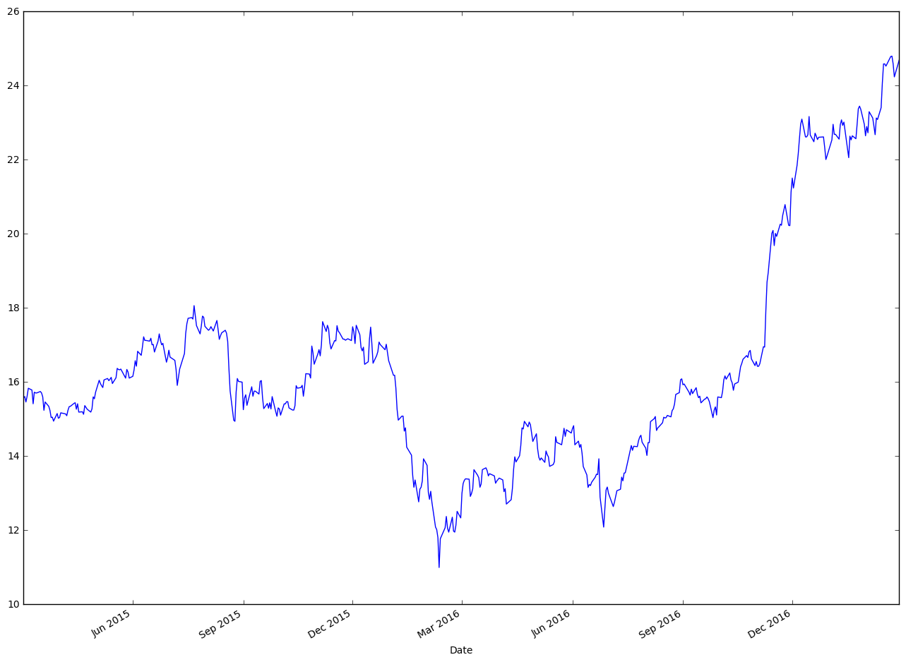
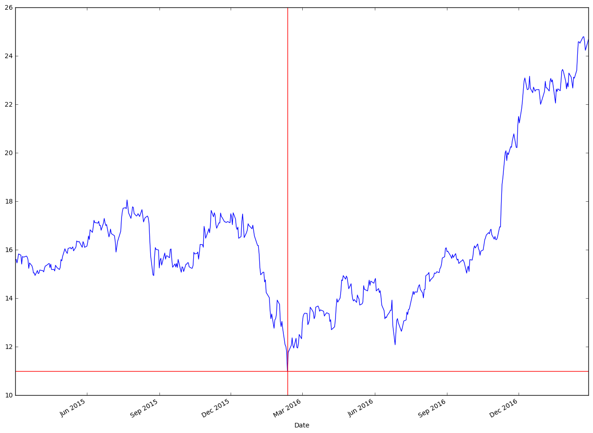

```python
#import pandas
import pandas as pd
from datetime import date
```


```python
# create a new variable to hold data and set dates as index
new_file = pd.read_csv("bac.csv",parse_dates=['Date'])
new_file.set_index('Date',inplace=True)  
print(new_file.tail())
    
```

                     Open       High    Low      Close     Volume  Adj Close
    Date                                                                    
    2015-03-06  16.000000  16.620001  16.00  16.219999  163207200  15.826622
    2015-03-05  15.920000  16.030001  15.75  16.000000   69510000  15.611959
    2015-03-04  15.960000  15.980000  15.76  15.840000   78441600  15.455839
    2015-03-03  16.030001  16.150000  15.96  16.040001   65689800  15.602202
    2015-03-02  15.790000  16.030001  15.72  16.010000   71402400  15.573020


```python
#import matplotlib
import matplotlib.pyplot as plt
```


```python
# use plot and plt.show() to plot graph
new_file['Adj Close'].plot(figsize=(16, 12))
plt.show()
```





```python
# lets get the minimum Adj closing price and get index
min_close_price = new_file['Adj Close'].min()
idx_close_price = new_file['Adj Close'].idxmin()
print(min_close_price)
idx_close_price
```

    10.988015


    Timestamp('2016-02-11 00:00:00')


```python
# now we want to draw lines at that index and min price
new_file['Adj Close'].plot(figsize=(16, 12))
verical_line = plt.axvline(date(2016,2,11), linewidth=1, color='r')
horizontal_line = plt.axhline(y=min_close_price, linewidth=1, color='r')
```


```python
# if you want to save this chart do it before you call show()

plt.savefig('stock_chart.pdf', format='pdf')
plt.show()

```





```python

```
